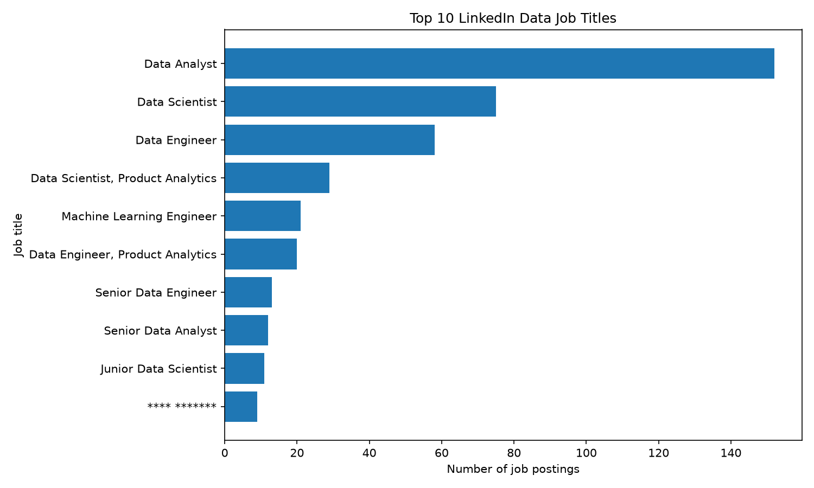
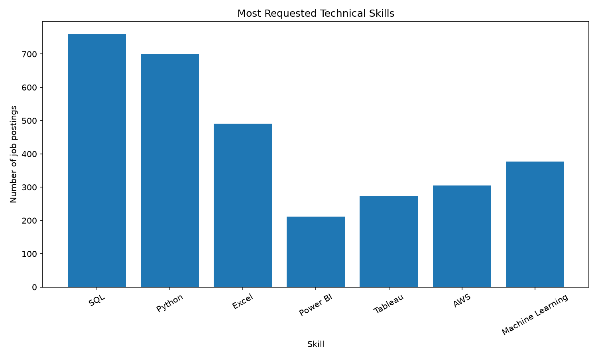

# LinkedIn Data Jobs Analyzer

## Overview

This project analyzes LinkedIn data-job postings to identify hiring trends,
popular job titles, leading companies, locations, and in-demand technical skills.

## Business Questions

- Which job titles appear most frequently?
- Which companies post the most jobs?
- Which locations have the most opportunities?
- Which technical skills are most requested?
- Which skills are common in Data Analyst jobs?
- How are job postings distributed over time?

## Data Pipeline

```text
Raw CSV
  ↓
Data inspection
  ↓
Data cleaning
  ↓
Skill extraction
  ↓
DuckDB database
  ↓
SQL analysis
```

## Technologies

- Python 3.14
- pandas
- NumPy
- DuckDB
- SQL
- Visual Studio Code

## Project Files

| File | Purpose |
|---|---|
| `linkedin_data_jobs.csv` | Original raw dataset |
| `clean_data.py` | Cleans the raw dataset |
| `cleaned_linkedin_data_jobs.csv` | Cleaned dataset |
| `extract_skills.py` | Extracts technical skills |
| `linkedin_jobs_with_skills.csv` | Dataset with skill columns |
| `load_to_database.py` | Loads data into DuckDB |
| `job_postings.duckdb` | Local SQL database |
| `run_queries.py` | Runs SQL analyses |
| `inspect_data.py` | Inspects the raw data |
| `verify_cleaned_data.py` | Verifies the cleaned data |
| `results.md` | Initial analysis findings |
| `data_dictionary.md` | Column descriptions |

## How to Run

Activate the virtual environment:

```powershell
.\.venv\Scripts\Activate.ps1
```

Install dependencies:

```powershell
python -m pip install pandas numpy duckdb
```

Run the data pipeline:

```powershell
python clean_data.py
python extract_skills.py
python load_to_database.py
python run_queries.py
```

## Key Findings

- Data Analyst is the most common job title.
- Meta has the highest number of postings in this dataset.
- SQL is the most frequently mentioned technical skill.
- Python is the second most frequently mentioned technical skill.
- Excel, Tableau, Power BI, AWS, and machine learning are also common requirements.
- SQL, Excel, Python, Tableau, and Power BI are important skills for Data Analyst roles.

## Limitations

- Some company names are masked.
- `work_type` and `employment_type` are empty in the source data.
- Some locations, companies, and posting dates are missing.
- Skill counts are based on text matching in job descriptions.

## Future Improvements

- Add charts or a dashboard.
- Standardize location names.
- Improve skill extraction with more advanced text processing.
- Deploy the pipeline to AWS.

## Visualizations

### Top Job Titles



### Technical Skill Demand



## Results

### Most Common Job Titles

- Data Analyst: 152 postings
- Data Scientist: 75 postings
- Data Engineer: 58 postings

### Most Requested Skills

- SQL: 759 postings
- Python: 700 postings
- Excel: 491 postings
- Machine Learning: 377 postings
- AWS: 305 postings

### Data Analyst Skills

For Data Analyst-related roles:

- SQL: 232 postings
- Excel: 164 postings
- Python: 139 postings
- Tableau: 136 postings
- Power BI: 112 postings
## AWS S3 Storage

The raw LinkedIn job-posting CSV is stored in an Amazon S3 bucket.

```text
s3://harish03413-linkedin-data-jobs-2026 /linkedin_data_jobs.csv
```

The bucket is private, and public access remains blocked.
